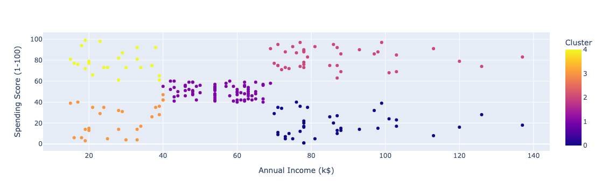

# Customer Segmentation using Birch Clustering

This repository provides a solution to the Customer Segmentation problem using the **Birch Clustering Algorithm** ([original reference](https://link.springer.com/article/10.1023/A:1009783824328), [simplified reference](https://medium.com/@noel.cs21/balanced-iterative-reducing-and-clustering-using-heirachies-birch-5680adffaa58)). The project includes data preprocessing, clustering analysis, and evaluation of the segmentation results on a customer dataset. The Birch algorithm is particularly useful for large datasets with a natural hierarchical structure, making it suitable for customer segmentation tasks.

## Table of Contents
- [Introduction](#introduction)
- [Dataset](#dataset)
- [Requirements](#requirements)
- [Project Structure](#project-structure)
- [Setup](#setup)
- [Usage](#usage)
- [Clustering Results](#clustering-results)
- [Evaluation Metrics](#evaluation-metrics)
- [Visualization](#visualization)
- [Notes and Customization](#notes-and-customization)
- [Contributing](#contributing)
- [License](#license)

## Introduction
Customer segmentation is a core part of targeted marketing, allowing businesses to group customers based on shared characteristics. This project applies the **Birch (Balanced Iterative Reducing and Clustering using Hierarchies)** algorithm to a dataset of mall customers. The Birch algorithm clusters customers based on their annual income and spending score, helping to identify different customer personas.

## Dataset
The project utilizes 2 customer datasets taken from Kaggle with the following features:

1) [`Mall_Customers.csv`](https://www.kaggle.com/datasets/vjchoudhary7/customer-segmentation-tutorial-in-python):
- `CustomerID`: Unique identifier for each customer
- `Gender`: Customer gender (categorical)
- `Age`: Customer age
- `Annual Income (k$)`: Customer's annual income in thousands of dollars
- `Spending Score (1-100)`: Score based on customer spending habits (1–100 scale)

2) [`Customers.csv`](https://www.kaggle.com/datasets/datascientistanna/customers-dataset):
- `CustomerID`: Unique identifier for each customer
- `Gender`: Customer gender (categorical)
- `Age`: Customer age
- `Annual Income ($)`: Customer's annual income
- `Spending Score (1-100)`: Score based on customer spending habits (1–100 scale)
- `Profession`: Customer's profession
- `Work Experience`: Customer's work experience
- `Family Size`: Customer's family size

> **Note:** This dataset needs to be placed in the root directory or specify the correct path for loading the CSV file.

## Requirements
The project requires the following Python libraries:
- `pandas`
- `numpy`
- `scikit-learn`
- `matplotlib`
- `plotly`

## Project Structure
- `Customer_Segmentation.ipynb`: Main Jupyter Notebook containing all steps for data preprocessing, clustering, and visualization.
- `Mall_Customers.csv`: Sample dataset used for clustering.
- `Customers.csv`: Another sample dataset used for clustering
- `requirements.txt`: Python libraries required to run the notebook.

## Setup

1. Clone the repository:
```bash
git clone https://github.com/PatrickDiallo23/Customer-Segmentation-BirchClustering.git
cd Customer-Segmentation-BirchClustering
```

2. Install required packages:
```bash
pip install -r requirements.txt
```

3. Open the Customer_Segmentation_Birch_Algorithm.ipynb file in Jupyter Notebook or JupyterLab:
```bash
jupyter notebook Customer_Segmentation_Birch_Algorithm.ipynb
```

>**Note:** Make sure that you have installed Jupyter Notebook or JupyterLab by running:
```bash
pip install jupyterlab
```
or
```bash
pip install notebook
```

4. Run the cells sequentially to:
- Load and preprocess the dataset
- Encode categorical variables
- Normalize the numerical features
- Run the Birch clustering algorithm to find optimal clusters
- Visualize the results

## Clustering Results
The project uses a range of 2 to 10 clusters and evaluates them based on Silhouette Score to determine the optimal number of clusters.
- Silhouette Analysis: Silhouette scores are calculated for each number of clusters, helping identify the best cluster configuration based on the compactness and separation of clusters.

## Evaluation Metrics
The clustering performance is evaluated using three metrics:

1. `Silhouette Score`: Measures how similar an object is to its own cluster compared to other clusters.
2. `Calinski-Harabasz Score`: Assesses the ratio of the sum of the intra-cluster dispersion to the inter-cluster dispersion. (TBD)
3. `Davies-Bouldin Score`: Measures the average similarity ratio of each cluster with its most similar cluster. (TBD)

These metrics are useful for assessing the compactness and separation of clusters, guiding the choice of the number of clusters.

## Visualization
The notebook uses Plotly for interactive 2D visualization of clusters:

- Scatter plots of Annual Income vs. Spending Score, colored by clusters, with hover functionality displaying other customer details (e.g., age, gender).

An example scatter plot generated:



## Notes and Customization
1. Normalization: The project includes two options for feature normalization:

- Min-Max Scaling: Scales features to a [0, 1] range.
- Standard Scaling: Scales features to have a mean of 0 and standard deviation of 1.
Uncomment the desired normalization method in the notebook to use it.

2. Birch Parameters:

- Threshold: Controls the radius of the subclusters; higher values allow for more scattered clusters.
- Branching Factor: Limits the maximum number of subclusters in each node.
- No. of clusters: The number of clusters to be returned to the BIRCH algorithm i.e., the number of clusters after the final step in the algorithm.

3. Custom Cluster Names: A placeholder function can assign names to clusters based on customer attributes like annual income and spending score.

## Contributing
Contributions are welcomed. If you would like to contribute to this project, please report any issues or follow these steps:

```
1. Fork the repository.
2. Create a new branch (git checkout -b new-branch).
3. Make your changes.
4. Commit your changes (git commit -m 'Add some changes').
5. Push to the branch (git push origin new-branch).
6. Open a Pull Request.
```

## License
This project is licensed under the MIT License. See the [LICENSE](./LICENSE) file for details.

### Acknowledgments: 
This project was developed as a hands-on learning experience in clustering algorithms for customer segmentation.
